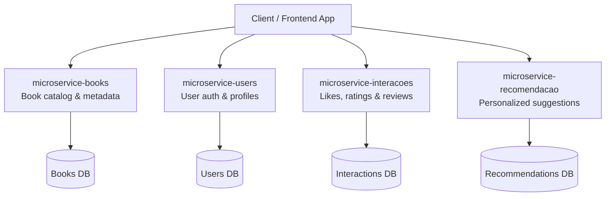

# 📚 LUMON - Virtual Reading Library

**LUMON** is a web platform developed during the **TCS 2X2Y Bootcamp**, designed as a **personal reading diary**. Inspired by [Letterboxd](https://letterboxd.com/) — the social network for movie lovers — LUMON brings this concept to the world of **books and literature**, allowing users to track their readings, share opinions, and receive personalized recommendations.

---

## 🚀 Project Repositories and Technologies

| Microservice                        | Language Badge |
|------------------------------------|----------------|
| [Frontend (Angular)](https://github.com/mikisazaka/Tcs-Front-Microsservicos) |    |
| [Users Service](https://github.com/Leleco04/microservico-users) |  |
| [Books Service](https://github.com/Libonico/microsservice-books) |  |
| [Interactions Service](https://github.com/Leleco04/microservico-interacoes) |  |
| [Recommendation Service](https://github.com/mikisazaka/microservice_recomendacao) |  |

---

## 🌟 Purpose

Our goal is to create a digital space where readers can log and organize their books while interacting with a community through reviews, likes, and themed lists — a true personal library with a social twist.

---

## 🧩 Key Features

- 📘 **Track your readings** and organize books by theme or interest.
- 👍 **Like books** you've enjoyed.
- ⭐ **Rate books** with a quick and intuitive rating system.
- 📝 **Write reviews** and share your thoughts with the community.
- 📚 **Create personalized reading lists**.

---

## ⚙️ Microservices Architecture

The system is built on a **microservices architecture**, which promotes modularity, scalability, and independent deployment of features.

### 📊 Architecture Diagram

## 🧑‍💻 Technologies Used

### 🔧 Backend

- Java 17
- Spring Boot (Lombok, Spring Security, Jakarta)
- JWT (JSON Web Tokens)
- H2 Database (for local testing)
- Maven

### 💻 Frontend

- Angular + TypeScript
- HTML5 + CSS3
- TailwindCSS
- SweetAlert2
- Google Cloud (for deployment)

### 🛠️ Tools

- Git & GitHub
- IntelliJ IDEA Community
- Visual Studio Code
- Postman

## 📈 Code Statistics

### Frontend

- TypeScript: 57.4%
- HTML: 34.1%
- CSS: 7.8%
- Others: 0.7%

### Backend

- Java: 100%

## 👥 Team

Project developed by:

- João Deliberador  
- Eduardo Czigler  
- Leandro Hideki  
- Pedro Liboni  
- Graciele Miki Sazaka  

## 🤝 Acknowledgements

We would like to thank **Tata Consultancy Services (TCS)** for providing the ideal **environment, structure, and mentorship** to make this project possible during the 2X2Y Bootcamp. This experience was incredibly valuable for our technical and professional growth.

## 📄 License

This is an academic project, created for educational and demonstration purposes only.
